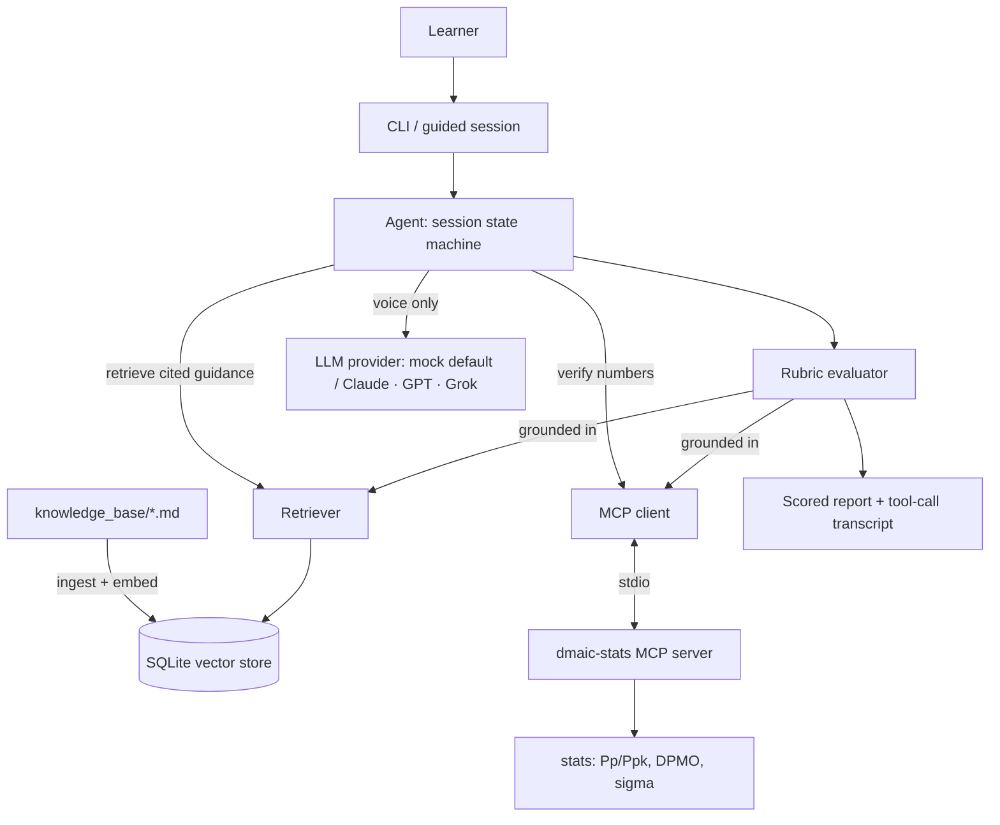

# DMAIC Coach

[](LICENSE)
[](pyproject.toml)
[](tests)
[](src/dmaic_coach/llm)

> A RAG-backed Six Sigma tutor that guides a learner through the **Measure** phase,
> role-plays a sceptical stakeholder, then **grades the learner's analysis** — with
> every grade grounded in retrieved methodology and in statistics it verifies itself
> over the Model Context Protocol (MCP). It runs in under five minutes with **no API
> key, no cloud, and no accounts** — the default provider is a deterministic mock, so
> the same demo runs for everyone.

<!-- Replace with the recorded GIF (see docs/demo.md for the 60-second script). -->


## What this demonstrates

- **Grounded RAG with citations** — a curated Measure knowledge base is chunked,
  embedded locally, and stored in SQLite; the coach and the evaluator retrieve and
  cite passages as `[file › heading]`.
- **An agent that evaluates, not just answers** — the learner's submission is scored
  against a Measure rubric. Crucially, the grade comes from deterministic logic
  grounded in *verified* numbers and *retrieved* standards, not from an LLM's opinion.
- **Tool-use over MCP** — the statistics tool (Pp/Ppk, DPMO, sigma level) is a real
  MCP server; the agent calls it over stdio to independently verify the learner — and
  to expose the stakeholder's unsupported claim.
- **LLM-agnostic by design** — a thin provider layer swaps mock / Claude / GPT / Grok.
  Correctness never depends on the LLM; the model only supplies natural-language voice.
- **Domain authority** — the methodology (operational definitions, MSA, Pp/Ppk vs
  Cp/Cpk, the 1.33 threshold, the 1.5σ shift) is correct, not decorative.

## Architecture



## Setup (under 5 minutes)

```bash
git clone <your-fork-url> dmaic-coach && cd dmaic-coach
python3 -m venv .venv && source .venv/bin/activate
pip install -e ".[dev]"      # mcp, numpy, scipy, pyyaml, rich, pytest

make demo                    # deterministic scripted session — no key needed
```

`make demo` indexes the knowledge base and runs a full scripted session. For an
interactive session where you submit your own analysis:

```bash
make run
```

To run with a live LLM voice instead of the mock, copy `.env.example` to `.env`,
set `LLM_PROVIDER` and the matching API key, and install the extra
(`pip install -e ".[anthropic]"`, etc.). Everything else is identical.

## Example run

The scenario: a call-centre Average Handle Time process. The stakeholder, *Maria*,
insists capability is "around Ppk 1.5". The agent verifies the data and grades a
learner who pushed back:

```text
╭──────────────── Maria Lindqvist · Process Owner ─────────────────╮
│ Honestly, our handle time is fine. Last I heard capability was   │
│ around Ppk 1.5 — comfortably within target. Do we remeasure?     │
╰──────────────────────────────────────────────────────────────────╯

  Measure rubric — grounded evaluation
  Data collection plan & operational definitions   2/3   [02-data-collection-plan.md › Sampling]
  Measurement system analysis awareness            2/3   [03-measurement-system-analysis.md › MSA]
  Correct capability calculation (Pp/Ppk)          3/3   Learner Ppk=0.60 vs verified Ppk=0.64
  Correct interpretation vs. 1.33 threshold        3/3   [04-process-capability.md › Interpreting]
  Challenged the unsupported stakeholder claim     3/3   verified 0.64 vs claimed 1.5
  Baseline sigma level / DPMO reported             3/3   Learner 3.10 vs verified 3.14

╭──────────────────────────── Verdict ─────────────────────────────╮
│ Score 17/18 (94%). Verified Ppk=0.64 → NOT capable; stakeholder  │
│ claimed Ppk≈1.5. Learner correctly challenged it.                │
╰──────────────────────────────────────────────────────────────────╯

╭───────────────── Reasoning & tool-call transcript ───────────────╮
│ PLAN: scope → briefing → cited coaching → verify via MCP → grade │
│ MCP CALL  dmaic-stats.capability(lsl=240, usl=600, data[n=40])   │
│ MCP CALL  dmaic-stats.dpmo(defects=2, units=40)                  │
│ VERIFIED  Ppk=0.64  capable=False  baseline_sigma=3.14  oos=2/40 │
╰──────────────────────────────────────────────────────────────────╯
```

The full captured transcript is in [`docs/example_run.txt`](docs/example_run.txt).

## Swap in your own knowledge base

The retrieval corpus is just Markdown in [`knowledge_base/`](knowledge_base/).
Replace or extend the files (keep meaningful headings — they become citation
anchors), then re-index:

```bash
make ingest
```

See [`knowledge_base/README.md`](knowledge_base/README.md) for the format.

## Tech stack

Python 3.10+ · official **MCP** Python SDK (FastMCP) · numpy/scipy for statistics ·
a dependency-free local hashing embedder (optional `fastembed`) · SQLite vector
store · `rich` CLI · pytest. No external services.

## Limitations (honest)

- **Scope is one phase, one scenario.** Measure only, a single call-centre dataset
  and one stakeholder persona — by design, to stay polished. Not a full DMAIC tool.
- **The default LLM is a deterministic mock.** It exercises the real pipeline
  (retrieval, MCP tool-use, grading) but does not generate free-form text; set a
  provider key for live natural-language voice.
- **The local embedder is lexical, not semantic.** It is deterministic and offline;
  for harder retrieval install the optional `fastembed` extra.
- **Capability uses overall sigma (Pp/Ppk).** With ungrouped individuals there are no
  subgroups for Cp/Cpk — the tool states this assumption explicitly.
- **Grading is rubric-deterministic**, deliberately. It rewards reproducibility and
  defensibility over open-ended judgement.

## License

MIT — see [LICENSE](LICENSE).
